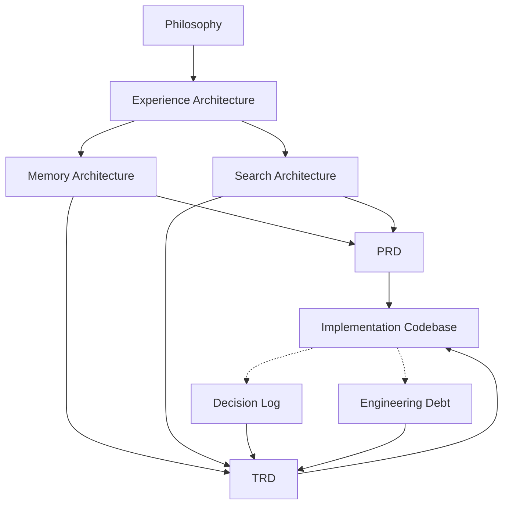

# Stashly Documentation Governance

**Status**: ACTIVE  
**Version**: 1.0  
**Authority**: Architecture and Product Alignment System  
**Last Updated**: 2026-06-25

---

## Table of Contents
1. [Purpose](#purpose)
2. [Documentation Layers](#documentation-layers)
3. [Documentation Hierarchy](#documentation-hierarchy)
4. [Responsibilities](#responsibilities)
5. [Dependency Rules](#dependency-rules)
6. [Frozen vs Living Documents](#frozen-vs-living-documents)
7. [Update Rules](#update-rules)
8. [Architectural Principles](#architectural-principles)
9. [Future Documentation Roadmap](#future-documentation-roadmap)

---

## Purpose

Documentation within Stashly exists to prevent **architectural drift**. Architectural drift occurs when implementation, product behavior, and architectural intent silently diverge.

By maintaining a clear documentation system, Stashly ensures that:
* Every engineering decision remains traceable to explicit product intent.
* Each document has a single responsibility and a clear boundary.
* Implementation does not silently redefine architecture.
* Product, architecture, and engineering remain aligned as the system evolves.

---

## Documentation Layers

The Stashly documentation ecosystem is structured into distinct vertical layers. Each layer answers a different class of question.

### Core Identity & Experience (Timeless)
* **Philosophy** ([Philosophy.md](/Users/sahilkishor/stashly/docs/product/Philosophy.md))
  * *Purpose*: Defines why Stashly exists and the non-negotiable beliefs that govern the product.
  * *Scope*: Mission, identity, trust model, retrieval-first philosophy, and organizational burden principles.
  * *Update Cadence*: Extremely rare; updated only when foundational product beliefs change.
* **Experience Architecture** ([Experience-Architecture.md](/Users/sahilkishor/stashly/docs/product/Experience-Architecture.md))
  * *Purpose*: Defines how Stashly should feel in use.
  * *Scope*: Interaction principles, emotional outcomes, and user-facing experience patterns.
  * *Update Cadence*: Rare; updated when the intended interaction model changes materially.

### System Specifications (Living Architecture)
* **Memory Architecture** ([Memory-Architecture-V1.md](/Users/sahilkishor/stashly/docs/product/Memory-Architecture-V1.md))
  * *Purpose*: Defines how knowledge is represented.
  * *Scope*: `MemoryV1`, Canonical Representation, Derived Data boundaries, lifecycle, and recoverability rules.
  * *Update Cadence*: Medium; updated when the representation contract changes.
* **Search Architecture** ([Search-Architecture.md](/Users/sahilkishor/stashly/docs/product/Search-Architecture.md))
  * *Purpose*: Defines how knowledge is retrieved.
  * *Scope*: Retrieval Contract, candidate generation, ranking, Context Builder responsibilities, and retrieval boundaries.
  * *Update Cadence*: Medium; updated when retrieval behavior or retrieval boundaries change.

### Technical & Product Specifications (Living Requirements)
* **PRD** ([PRD.md](/Users/sahilkishor/stashly/docs/product/PRD.md))
  * *Purpose*: Defines what product capabilities are delivered to users.
  * *Scope*: User capabilities, product scope, user jobs, requirements, and product boundaries.
  * *Update Cadence*: Frequent; updated as product scope evolves.
* **TRD** ([TRD.md](/Users/sahilkishor/stashly/docs/product/TRD.md))
  * *Purpose*: Defines how the system is engineered.
  * *Scope*: Subsystem responsibilities, engineering boundaries, operational architecture, and implementation notes.
  * *Update Cadence*: Frequent; updated when system engineering changes.

### Operational Logging & Reality (Living Status)
* **Architecture Status** ([ARCHITECTURE_STATUS.md](/Users/sahilkishor/stashly/docs/product/ARCHITECTURE_STATUS.md))
  * *Purpose*: Monitors active, locked, superseded, and operational document states.
  * *Scope*: Status mapping of all architectural specifications.
  * *Update Cadence*: Frequent; updated whenever document authority changes.
* **Decision Log** ([architecture-decisions.md](/Users/sahilkishor/stashly/docs/engineering/architecture-decisions.md))
  * *Purpose*: Captures formal design decisions and implementation tradeoffs.
  * *Scope*: Chosen approaches, compromises, and decision rationale.
  * *Update Cadence*: Dynamic; updated as meaningful technical decisions are made.
* **Engineering Debt** ([engineering-debt.md](/Users/sahilkishor/stashly/docs/engineering/engineering-debt.md))
  * *Purpose*: Logs known deviations between target architecture and current implementation.
  * *Scope*: Temporary concessions, cleanup work, and unresolved drift risks.
  * *Update Cadence*: Dynamic; updated whenever debt is introduced or retired.

---

## Documentation Hierarchy

The diagram below represents the flow of intent. Higher-level documents constrain lower-level documents. Operational logs record reality but do not redefine architecture.

---

## Responsibilities

Every document in the Stashly stack serves a unique, non-overlapping responsibility:

* **Philosophy**: Defines *why Stashly exists*.
* **Experience Architecture**: Defines *how Stashly should feel*.
* **Memory Architecture**: Defines *how knowledge is represented*.
* **Search Architecture**: Defines *how knowledge is retrieved*.
* **PRD**: Defines *what product capabilities are delivered to users*.
* **TRD**: Defines *how the system is engineered*.
* **Decision Log**: Captures *why specific implementation choices were made*.
* **Engineering Debt**: Tracks *where implementation currently falls short of target architecture*.

---

## Dependency Rules

To prevent circular reasoning and maintain clear boundaries, documentation dependencies follow these rules:

1. **Top-Down Intent**: Lower layers may reference higher layers for justification. Higher layers must never depend on lower layers.
2. **One Question Per Document**: A document may reference another layer, but it must not absorb that layer's responsibility.
3. **Implementation Isolation**: Philosophy and architecture documents must remain free of implementation-specific detail except inside explicitly labeled `Current Implementation Note` blocks.
4. **Architecture Governs Engineering**: The TRD applies architecture to the real system, but it does not redefine Memory Architecture, Search Architecture, or Philosophy.
5. **Operational Logs Observe Reality**: Decision Log and Engineering Debt describe implementation reality. They do not become the source of truth for product or architecture.

---

## Frozen vs Living Documents

Stashly divides documents into stable foundations and adaptive specifications:

### Mostly Frozen
* **Philosophy** and **Experience Architecture**.
* *Rationale*: Mission, identity, and intended experience should remain highly stable. Frequent changes here indicate product fragmentation.

### Living Documents
* **Memory Architecture**, **Search Architecture**, **PRD**, **TRD**, **Architecture Status**, **Decision Log**, and **Engineering Debt**.
* *Rationale*: These files must evolve when representation, retrieval, product scope, or engineering reality changes.

---

## Update Rules

When elements of Stashly evolve, documentation updates must follow predefined pathways:

* **Changing Code Implementation**:
  $$\text{Implementation} \longrightarrow \text{Decision Log / Engineering Debt} \longrightarrow \text{TRD} \longrightarrow \text{Architecture Status}$$
* **Changing Representation or Retrieval Architecture**:
  $$\text{Memory Architecture / Search Architecture} \longrightarrow \text{TRD} \longrightarrow \text{Implementation}$$
* **Changing Product Direction**:
  $$\text{Philosophy} \longrightarrow \text{Experience Architecture} \longrightarrow \text{Memory/Search Architecture} \longrightarrow \text{PRD} \longrightarrow \text{TRD} \longrightarrow \text{Implementation}$$

### Governance Invariants

**Architectural Alignment**

If implementation and architecture disagree, either the implementation must be updated or the architecture must be revised immediately. Architectural drift is never permitted.

**Reality Over Intent**

Documentation must always describe the current state of the system truthfully.

- No documentation may describe planned behavior as implemented behavior.
- No documentation may describe implemented behavior as planned behavior.
- Future capabilities must be explicitly identified as roadmap items or architectural targets.
- Current implementation details must be clearly distinguished from long-term architectural direction.
- Documentation is a representation of reality, not aspiration.

---

## Architectural Principles

Our documentation governance relies on these central axioms:
* **One Document, One Responsibility**: Every file answers one primary question.
* **Source of Truth by Layer**: Each concept should have one authoritative home. Other documents should reference it briefly rather than restating it.
* **Intent vs. Realization vs. Reality**: Product documents describe intent. Technical documents describe realization. Operational documents describe reality.
* **No Silent Drift**: Documentation and implementation must stay aligned through explicit updates, never by implication.
* **Traceability**: Product scope should trace to architecture, architecture should trace to engineering, and implementation should trace back to documented intent.
* **Minimal Duplication**: Every concept should have one authoritative explanation. Other documents should reference that explanation rather than restating it.

---

## Future Documentation Roadmap

As the system expands, additional documents may be introduced where new responsibilities justify them:

* **API Reference**: External route contracts.
* **Connector Architecture**: Boundaries for external integrations.
* **Agent Architecture**: Responsibilities for autonomous task execution over memory.
* **Observability Guide**: Operational monitoring and service health.
* **Deployment Architecture**: Runtime topology and deployment boundaries.
* **Security & Isolation Architecture**: Permission, tenancy, and isolation guarantees.
