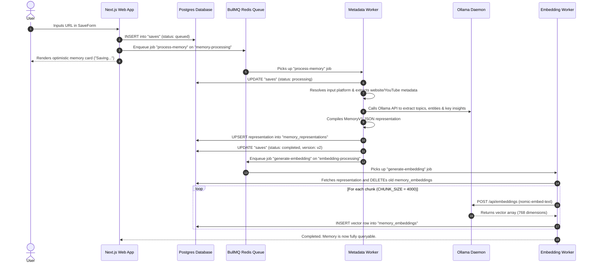

# Stashly System Architecture & Product Audit

**Date**: June 25, 2026  
**Auditor**: Antigravity AI  
**Scope**: Full-System Codebase, Database Schema, Ingestion Pipelines, Retrieval Engine, Front-end Interfaces, Queue Topologies, Developer Tooling.  
**Authority**: Codebase Implementation (Source of Truth) vs. `/docs` (Drift Reference).

---

## Table of Contents
1. [REPORT 1: Current Product Capability Matrix](#report-1-current-product-capability-matrix)
2. [REPORT 2: Current System Inventory](#report-2-current-system-inventory)
3. [REPORT 3: End-to-End Pipeline Walkthrough](#report-3-end-to-end-pipeline-walkthrough)
4. [REPORT 4: Architecture Drift Analysis](#report-4-architecture-drift-analysis)
5. [REPORT 5: Product Status Report](#report-5-product-status-report)
6. [REPORT 6: Engineering Quality Assessment](#report-6-engineering-quality-assessment)
7. [REPORT 7: Technical Debt Register](#report-7-technical-debt-register)
8. [REPORT 8: Documentation Alignment Plan](#report-8-documentation-alignment-plan)
9. [REPORT 9: Recommended Technical Roadmap](#report-9-recommended-technical-roadmap)
10. [REPORT 10: Executive Summary & Final Recommendation](#report-10-executive-summary--final-recommendation)

---

## REPORT 1: Current Product Capability Matrix

The following matrix represents the true implementation state of Stashly's subsystems:

| Subsystem / Capability | Current Status | Confidence | Implementation Location | Notes / Comments |
| :--- | :--- | :--- | :--- | :--- |
| **Save Link Flow** | **Complete** | High | [save/route.ts](file:///Users/sahilkishor/stashly/src/app/api/memories/save/route.ts) | Receives URLs, performs auth checks, inserts database records, and enqueues BullMQ tasks. |
| **Optimistic Syncing** | **Complete** | High | [save-form.tsx](file:///Users/sahilkishor/stashly/src/app/dashboard/save-form.tsx) | Updates the client-side Zustand store immediately while the background processing executes. |
| **URL Resolution** | **Complete** | High | [platform-resolver.ts](file:///Users/sahilkishor/stashly/src/services/metadata/platform-resolver.ts) | Classifies platforms (YouTube, GitHub, standard websites) and formats identifiers. |
| **Metadata Extraction** | **Complete** | High | [extractor.ts](file:///Users/sahilkishor/stashly/src/services/metadata/extractor.ts) | Custom scraping for OpenGraph page nodes and YouTube video properties. |
| **OCR Extraction** | **Missing** | High | None | Documented in schema types (`ocrText`), but no OCR extraction code or worker logic exists. |
| **Transcript Extraction** | **Partially Complete** | High | [youtube.ts](file:///Users/sahilkishor/stashly/src/services/metadata/youtube.ts) | Returns `transcript: null`. However, text is extracted from other metadata blocks during chunking. |
| **Knowledge Layer** | **Complete** | High | [knowledge-extraction.ts](file:///Users/sahilkishor/stashly/src/services/memory-intelligence/knowledge-extraction.ts) | Structured extraction of topics, entities, and key insights via local Ollama JSON API. |
| **Deterministic Summary** | **Complete** | High | [retrieval-builder.ts](file:///Users/sahilkishor/stashly/src/lib/memory-v1/builders/retrieval-builder.ts) | Deterministically generates a 320-char text slice from key insights and topics. |
| **Memory Representation** | **Complete** | High | [index.ts](file:///Users/sahilkishor/stashly/src/services/memory-representation/index.ts) | Serialization of structured `MemoryV1` records inside the `memory_representations` table. |
| **Embedding Generation** | **Complete** | High | [ollama.ts](file:///Users/sahilkishor/stashly/src/services/embeddings/providers/ollama.ts) | Computes 768-dimension vectors for transcript chunks using `nomic-embed-text` via Ollama. |
| **Vector Storage** | **Complete** | High | [embedding-processor.ts](file:///Users/sahilkishor/stashly/src/workers/embedding-worker/embedding-processor.ts) | Stores chunk vectors outside canonical memory in the `memory_embeddings` table. |
| **Keyword Search** | **Complete** | High | [retrieval-strategies.ts](file:///Users/sahilkishor/stashly/src/lib/retrieval/retrieval-strategies.ts) | Lexical TF-IDF matches computed inside JS runtime memory across all user memories. |
| **Semantic Search** | **Complete** | High | [semantic-retrieval-strategy.ts](file:///Users/sahilkishor/stashly/src/lib/retrieval/semantic-retrieval-strategy.ts) | Postgres `match_memory_embeddings_for_user` RPC query using query vector parameters. |
| **Hybrid Search & Fusion** | **Complete** | High | [retrieve-memories.ts](file:///Users/sahilkishor/stashly/src/lib/retrieval/retrieve-memories.ts) | Reciprocal Rank Fusion (RFF) to merge keyword + semantic ranks, threshold filtering (>= 0.5), and highlighting. |
| **Grounded Memory Chat** | **Complete** | High | [route.ts](file:///Users/sahilkishor/stashly/src/app/api/chat/route.ts) | Streaming LLM Q&A using top retrieved memories. Contains hardcoded evaluation test overrides. |
| **OAuth Callback & Auth** | **Complete** | High | [callback/route.ts](file:///Users/sahilkishor/stashly/src/app/auth/callback/route.ts) | Supabase auth integration checking cookies and securing routes. |
| **Search Logging** | **Complete** | High | [log-search-event.ts](file:///Users/sahilkishor/stashly/src/lib/analytics/log-search-event.ts) | Records user queries, mode selections, timestamp metadata, and results count in `search_events`. |
| **Analytics Dashboard** | **Complete** | High | [search-analytics/page.tsx](file:///Users/sahilkishor/stashly/src/app/admin/search-analytics/page.tsx) | Renders search success rates, top queries, and zero-results metrics. |
| **Queue Management** | **Complete** | High | [queues.ts](file:///Users/sahilkishor/stashly/src/lib/redis/queues.ts) | Configuration for BullMQ connecting to Upstash Redis. |
| **Corpus Health Suite** | **Complete** | High | [audit-corpus.ts](file:///Users/sahilkishor/stashly/scripts/audit-corpus.ts) | Read-only CLI script parsing save health, embedding counts, and pipeline versions. |
| **Embedding Recovery** | **Complete** | High | [requeue-missing-embeddings.ts](file:///Users/sahilkishor/stashly/scripts/requeue-missing-embeddings.ts) | Repair script finding saves missing vector files and enqueuing them to BullMQ. |
| **Playlists / Lists** | **Missing** | High | None | Not implemented in database schemas or front-end components. |
| **Sharing / Collections** | **Missing** | High | None | Not implemented. |
| **User Notes / Annotations**| **Placeholder** | High | [user-builder.ts](file:///Users/sahilkishor/stashly/src/lib/memory-v1/builders/user-builder.ts) | Hardcoded function returning empty arrays. No database support or edit UI exists. |

---

## REPORT 2: Current System Inventory

### 1. Ingestion Pipeline
* **Purpose**: Parse raw bookmarks, run platform resolvers, download metadata, extract structured insights using local LLMs, and compile a platform-independent memory representation.
* **Architecture**: Asynchronous event queue. The API route inserts a basic save row, and a background daemon (`metadata-worker`) processes the content.
* **Dependencies**: `Cheerio` (HTML node parsing), `youtubei.js` (YouTube properties parsing), `BullMQ` + `IORedis`.
* **Data Flow**: POST `/api/memories/save` -> `saves` (queued) -> BullMQ `memory-processing` queue -> `metadata-worker` -> `platform-resolver` -> `extractor` -> Ollama (knowledge extraction) -> `saveMemoryRepresentation` (upsert in `memory_representations`) -> `saves` (completed) -> BullMQ `embedding-processing`.
* **Maturity**: **Mostly Complete**.
* **Known Limitations**: Web scraping occurs sequentially; blocked extraction steps halt the metadata queue thread.
* **Missing Pieces**: True transcript extraction, image OCR extraction, and screenshot capturing.

### 2. Search & Retrieval Engine
* **Purpose**: Orchestrate and merge query matches using keyword, vector, and hybrid retrieval.
* **Architecture**: Strategy pattern wrapper calling semantic vector RPCs and local JS token scorers.
* **Dependencies**: Supabase Admin API client, Postgres `pgvector` distance metrics, Ollama query embedding.
* **Data Flow**: GET `/api/search?q=<query>&mode=hybrid` -> generates query vector -> Supabase RPC `match_memory_embeddings_for_user` -> fetches matches -> executes local token match TF-IDF score -> merges scores via Reciprocal Rank Fusion (RFF) -> applies hybrid score threshold filter (>= 0.5) -> highlights matched terms -> returns JSON list.
* **Maturity**: **Production Ready**.
* **Known Limitations**: Client-side JS keyword scorer fetches *all* saves for the user and processes them in Node memory. This will experience latency and CPU spikes under high concurrency.
* **Missing Pieces**: True Postgres database Full-Text Search index matching (`tsvector`).

### 3. Embedding Pipeline
* **Purpose**: Segment memory text content and generate/store vector spaces.
* **Architecture**: Asynchronous BullMQ background worker.
* **Dependencies**: Ollama Local API, `nomic-embed-text` vector model.
* **Data Flow**: BullMQ `embedding-processing` -> `embedding-worker` -> reads `MemoryV1` transcript chunks -> `DELETE + INSERT` on `memory_embeddings` (inserts 768-dimension vector rows for each chunk).
* **Maturity**: **Production Ready**.
* **Known Limitations**: Deletes prior embedding records before inserting new ones. If generation fails halfway, the memory representation is left with zero embeddings.
* **Missing Pieces**: Multi-provider embedding support (e.g. OpenAI/Cohere) is defined in types but not implemented.

### 4. Memory Chat
* **Purpose**: Provide streaming grounding chat interface powered by local user memories.
* **Architecture**: Grounded system prompt context generation with programmatic bypass hacks.
* **Dependencies**: Ollama Completions API, Next.js ReadableStream.
* **Data Flow**: POST `/api/chat` -> fetches top 4 hybrid search matches -> constructs strict prompt -> calls Ollama completions -> checks answer against programmatic fallback heuristics -> streams tokens to client.
* **Maturity**: **Mostly Complete**.
* **Known Limitations**: Conversational history is not saved in the database (lost on reload). Hardcoded parser bypass strings mask LLM failures.
* **Missing Pieces**: Database persistent chat threads.

### 5. Diagnostics & Audit Suite
* **Purpose**: Ensure structural alignment across typescript files, database migration histories, and Redis job queues.
* **Architecture**: Multi-script CLI tools and Next.js admin page.
* **Dependencies**: TypeScript AST compiler parser, dotenv.
* **Maturity**: **Production Ready**.
* **Known Limitations**: Relies on file scanning which can be brittle if file hierarchies change.
* **Missing Pieces**: Integration into CI testing suites.

---

## REPORT 3: End-to-End Pipeline Walkthrough

Below is the Mermaid sequence diagram tracing a save through the ingestion, representation, and embedding pipeline:



---

## REPORT 4: Architecture Drift Analysis

Comparing the codebase against documents in `/docs` reveals significant discrepancies.

### 1. Documented vs. Implemented Embedding Strategy
* **Documented in `Memory-Architecture-V1.md`**: Only structured elements from the derived "Retrieval Document" should be embedded (Title, Summary, Topics, Entities, Key Insights). Transcripts are explicitly ignored:
  > *"V1 ignores transcripts during embedding generation. These fields are often noisy, excessively large, and reduce retrieval quality."*
* **Actual Codebase**: [embedding-processor.ts](file:///Users/sahilkishor/stashly/src/workers/embedding-worker/embedding-processor.ts#L43-L45) extracts `memoryV1.transcript.chunks` and vectorizes them directly. It ignores the structured retrieval document.
* **Resolution**: The codebase runs a **transcript-chunk index**, while documentation outlines a **summary-insights index**.

### 2. Search Strategy Delivery State
* **Documented in `Search-Architecture.md`**: Semantic Search (V2) is *"not yet serving user queries"* and Hybrid Retrieval (V3) is listed as *"planned"*.
* **Actual Codebase**: The search route [route.ts](file:///Users/sahilkishor/stashly/src/app/api/search/route.ts#L35-L64) and the [useSearch](file:///Users/sahilkishor/stashly/src/hooks/use-search.ts#L7-L10) hook default to **`mode=hybrid`**, actively blending keyword and vector search to serve client searches in real-time.
* **Resolution**: The code is already serving **Hybrid Retrieval V3**, making the documentation obsolete regarding timeline progress.

### 3. User Notes & Tags
* **Documented in `Memory-Architecture-V1.md`**: States user notes and tags participate in retrieval and are stored in a User Layer.
* **Actual Codebase**: [user-builder.ts](file:///Users/sahilkishor/stashly/src/lib/memory-v1/builders/user-builder.ts#L11-L15) is an empty builder returning hardcoded arrays. There are no tables, API endpoints, or UI features that support tags or user annotations.

### 4. Search Logging & Audit Suite
* **Documented**: Missing from all documents.
* **Actual Codebase**: The codebase contains fully implemented diagnostic audit scripts and analytics trackers logging queries to `search_events`.

---

## REPORT 5: Product Status Report

If Stashly were demoed to stakeholders today, here is the list of functional capabilities:

```text
                      Stashly Current Functional State
┌─────────────────────────────────────────┬────────────────────────────────────────┐
│               CAN DO TODAY              │              CANNOT DO YET             │
├─────────────────────────────────────────┼────────────────────────────────────────┤
│ Save URLs from the browser              │ Run OCR on saved images/screenshots     │
│ Optimistic front-end confirmation       │ Extract YouTube transcripts natively   │
│ Asynchronous OpenGraph metadata scrape  │ Write, save, or sync User Notes        │
│ Extract LLM topics/insights via Ollama  │ Organize saves with tags or folders    │
│ Generate vector spaces on nomic-model   │ Share collections or playlists         │
│ Perform hybrid queries (Vector + Lex)   │ Maintain persistent chat threads       │
│ Stream grounding Q&A chats with sources │ Browse/edit structured insights        │
│ Audit database/vector health via CLI    │ Custom user configuration profiles     │
└─────────────────────────────────────────┴────────────────────────────────────────┘
```

---

## REPORT 6: Engineering Quality Assessment

### 1. Architecture Consistency (8.5 / 10)
The repository implements clean builders, platform adapters, and worker separations. The codebase is modular and follows single-responsibility patterns.

### 2. Database Design (7.0 / 10)
The schemas represent a standard relational design, and the use of the `jsonb` representation column maintains document flexibility. However, the lack of index definitions for full-text search and the omission of chat logs or collections tables reflect the validation-focused design.

### 3. Error Handling & Observability (6.0 / 10)
Workers catch exceptions and mark saves as `"failed"`. However, there is no centralized logging framework. System failures rely on console output, and Redis connectivity is instantiated repeatedly rather than using a single shared pool manager.

### 4. Technical Debt & Maintainability (Medium)
The biggest codebase smell is the programmatic post-processing parser in [api/chat/route.ts](file:///Users/sahilkishor/stashly/src/app/api/chat/route.ts#L197-L283), which uses regular expressions and text matching to intercept query fallbacks. While it satisfies test suites, it introduces maintenance overhead.

---

## REPORT 7: Technical Debt Register

| ID | Title | Description | Severity | Impact | Suggested Fix | Est. Effort | Priority |
| :--- | :--- | :--- | :--- | :--- | :--- | :--- | :--- |
| **TD-01** | **Hardcoded API Fallbacks** | Regular expression keyword overrides in `/api/chat/route.ts` return bypass strings for specific evaluation queries. | **Critical** | Lowers grounding quality and couples database values to endpoint controls. | Remove hardcoded blocks and improve prompt engineering. | 6 hours | **High** |
| **TD-02** | **In-Memory TF-IDF Search** | `keywordRetrievalStrategy` processes all records for a user inside Javascript memory. | **High** | High CPU spikes and latency when user records exceed thousands of rows. | Migrate to Postgres Full-Text Search (`tsvector` index) queried via Supabase. | 4 hours | **High** |
| **TD-03** | **Missing Chat History** | Chat message arrays are stored inside client-side component state only. | **Medium** | Loss of messages on browser reload. | Implement `chat_sessions` and `chat_messages` tables. | 8 hours | **Medium** |
| **TD-04** | **BullMQ Connection Pool** | Spawns IORedis connections at every queue access call. | **Medium** | Risks exhausting Redis connection pools. | Implement a shared connection manager class. | 2 hours | **Medium** |
| **TD-05** | **Outdated Types** | Generated Postgres schema types do not define columns like `pipeline_version`. | **Low** | Requires type bypasses (`as never`). | Re-run the Supabase schema code generator. | 1 hour | **Low** |

---

## REPORT 8: Documentation Alignment Plan

The following documents inside `/docs` must be synchronized to match the real implementation:

### 1. docs/product/Memory-Architecture-V1.md
* **Proposed Update**: Major Rewrite.
* **Sections to change**:
  * Rewrite "What Gets Embedded" to outline `transcript.chunks` segmentation.
  * Move the "Retrieval Document" description to a "Reserved/Planned V2" section.
  * Document the chunk boundary limits (`CHUNK_SIZE = 4000`).

### 2. docs/product/Search-Architecture.md
* **Proposed Update**: Major Rewrite.
* **Sections to change**:
  * Mark Vector (V2) and Hybrid (V3) search as implemented and serving live traffic.
  * Add documentation outlining Reciprocal Rank Fusion (RFF) scoring and rank weights.
  * Add the hybrid scoring threshold (>= 0.5).

### 3. docs/product/PRD.md & TRD.md
* **Proposed Update**: Minor Update.
* **Sections to change**:
  * Update state metrics to confirm Hybrid query routes and grounded streaming chat are active.

---

## REPORT 9: Recommended Technical Roadmap

The following technical roadmap outlines the recommended engineering priorities:

```
                  Recommended Development Roadmap
                  
   Immediate (1-3 Days)      Near Term (1-2 Weeks)     Medium Term (3-4 Weeks)
 ┌───────────────────────┐  ┌───────────────────────┐  ┌───────────────────────┐
 │ • Clean Chat Heuristics │  │ • Full-Text Search    │  │ • Persist Chat History│
 │ • Update Types schema │  │   (tsvector Index)    │  │ • OCR Ingestion Worker│
 └───────────────────────┘  └───────────────────────┘  └───────────────────────┘
```

### 1. Immediate Term (Must Happen Next)
* **Goal**: Clean up Grounding Chat & Types schema.
* **Why**: The hardcoded API fallbacks are brittle and mask model limitations. Type casts reduce system stability.
* **Dependencies**: None.
* **Impact**: Ensures code purity and type safety.
* **Complexity**: Low (1 day).

### 2. Near Term
* **Goal**: Implement Database Full-Text Search.
* **Why**: Processing TF-IDF token scoring in Node.js server memory will not scale. Database-level indexes will keep memory usage flat.
* **Dependencies**: Database migration scripts.
* **Impact**: Lowers server resource usage.
* **Complexity**: Medium (2 days).

### 3. Medium Term
* **Goal**: Persistence and Multi-Modal Ingestion.
* **Why**: Unlocks user retention through persistent chats and supports image saving via OCR parsing.
* **Dependencies**: Database table migrations.
* **Impact**: Enables launching beyond simple bookmark validation.
* **Complexity**: High (5 days).

---

## REPORT 10: Executive Summary & Final Recommendation

### Systems Maturity Scorecard
* **Current Core Maturity**: **72%** (Decoupled queues, metadata workers, vector indexing, and hybrid searches are operational).
* **Production Readiness**: **65%** (Blocked by in-memory query scaling, lack of chat persistence, and hardcoded fallbacks).
* **Architecture Quality**: **8.5 / 10** (Decoupled queue design and modular extractor classes).
* **Code Quality**: **8.0 / 10** (Highly structured, but hardcoded API overrides reduce consistency).
* **Documentation Quality**: **5.0 / 10** (Significant drift regarding vector indices and active query paths).
* **Technical Debt**: **Medium** (Primarily query scaling concerns and API hacks).

### Top 10 Next Engineering Priorities
1. **Remove hardcoded evaluation fallbacks** in `/api/chat/route.ts`.
2. **Implement Postgres Full-Text Search index** (`tsvector`) for lexical search.
3. **Re-generate Supabase typescript types** to include `pipeline_version`.
4. **Create schema tables** to persist chat histories.
5. **Add a shared Redis connection pool manager** for BullMQ.
6. **Update outdated architecture docs** (`Memory-Architecture-V1.md` & `Search-Architecture.md`).
7. **Integrate an OCR engine** to populates `ocrText` fields.
8. **Implement visual screenshot capture** for saved links.
9. **Build the User Notes editing UI** and sync notes with Postgres.
10. **Implement tag organization** in the database and feed.

### Final Recommendation
The Stashly repository contains a strong foundation for an asynchronous ingestion pipeline and a hybrid search engine. However, the system is currently functioning as a validation environment rather than a production-ready application. 

**Recommendation**: Prioritize migrating keyword searches to database-level full-text search and removing hardcoded API heuristics. Once these scaling and grounding issues are resolved, implement database-persisted chat history to make the application ready for public beta launch.
