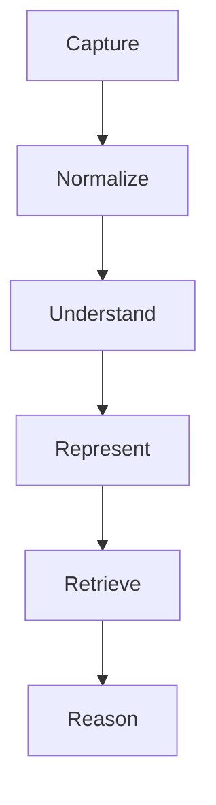
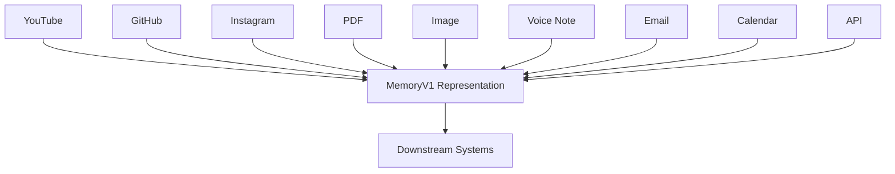
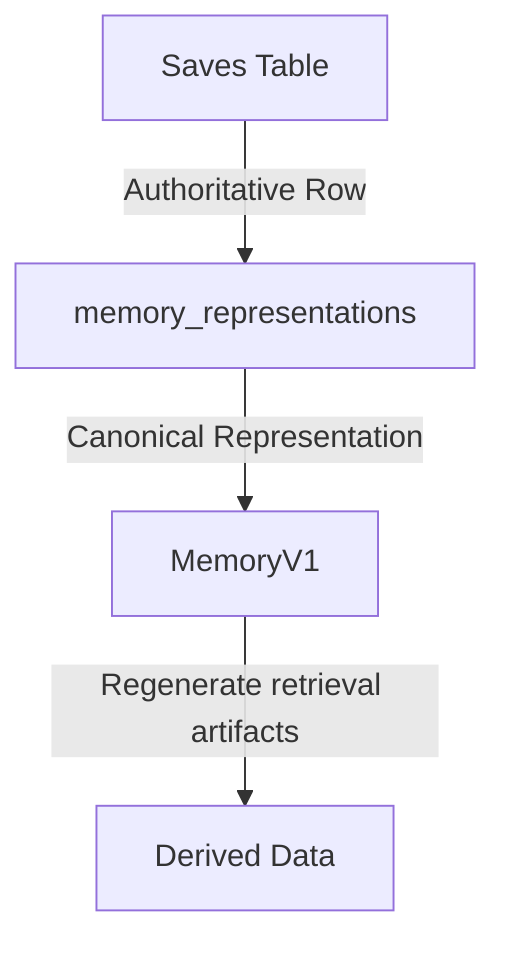
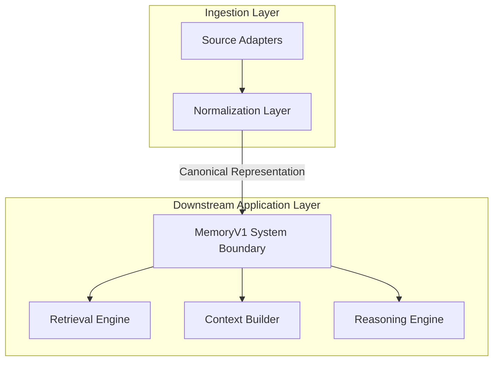
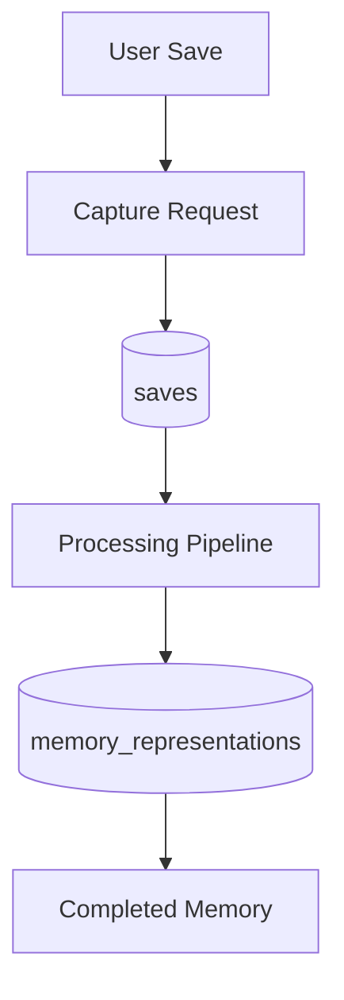
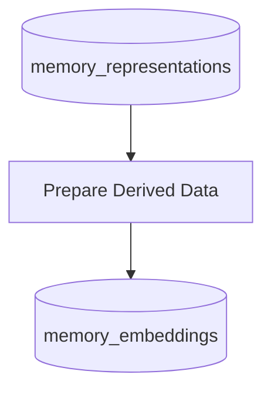
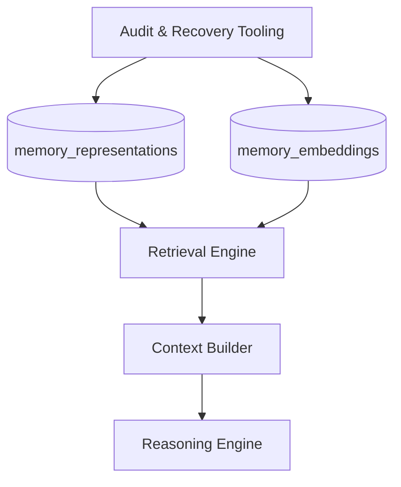
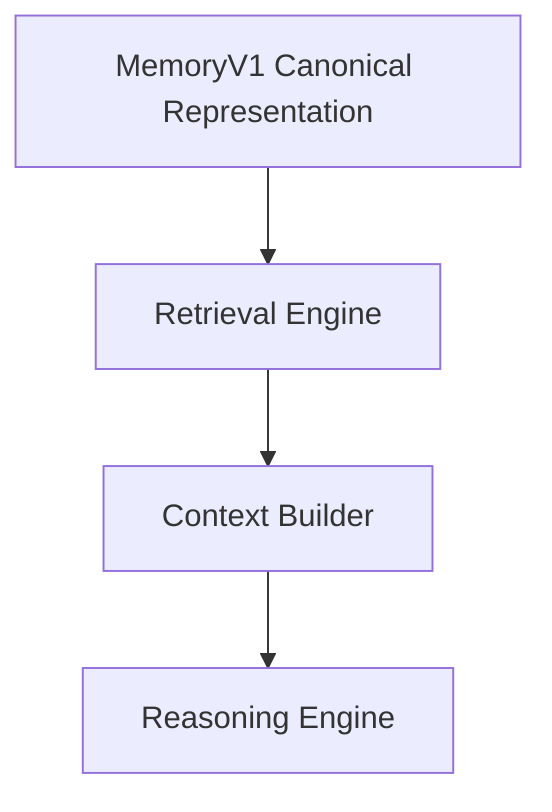

# Memory Architecture V1

**Status**: ACTIVE  
**Version**: 1.0  
**Pipeline Version**: v2  
**Authority**: Ingestion and Memory Representation Lifecycle  
**Last Updated**: 2026-06-25  

---

## Table of Contents
1. [Why MemoryV1 Exists](#why-memoryv1-exists)
2. [The Memory Contract](#the-memory-contract)
3. [Universal Knowledge Ingestion](#universal-knowledge-ingestion)
4. [Design Principles](#design-principles)
5. [MemoryV1 Schema & Layers](#memoryv1-schema--layers)
6. [Database Model](#database-model)
7. [Canonical vs Derived Data](#canonical-vs-derived-data)
8. [MemoryV1 as the System Boundary](#memoryv1-as-the-system-boundary)
9. [Pipeline Lifecycle](#pipeline-lifecycle)
10. [Pipeline Versioning](#pipeline-versioning)
11. [Embedding Contract](#embedding-contract)
12. [Recovery & Maintenance](#recovery--maintenance)
13. [Search & Chat Relationship](#search--chat-relationship)
14. [Evolution Path](#evolution-path)
15. [Architectural Principle](#architectural-principle)

---

## Why MemoryV1 Exists

In Stashly, a saved item is not treated simply as a link or title bookmark. Source platforms are volatile: links break, layouts change, access disappears, and metadata shifts over time.

`MemoryV1` exists to give every saved item a durable, platform-independent **Canonical Representation**. By normalizing raw inputs into one structured memory document, Stashly preserves the user's saved knowledge in a form that remains stable even when source platforms do not.

This architecture serves four purposes:

* **Durable Knowledge Retention**: Stored knowledge remains useful even if the source changes or disappears.
* **Platform Independence**: Downstream systems operate on one representation rather than many source-specific formats.
* **Retrieval Readiness**: Memory is structured so retrieval can operate consistently across all content types.
* **Grounded AI Readiness**: Memory can be safely supplied to downstream reasoning without depending on raw source payloads.

---

## The Memory Contract

Every supported input source must satisfy the same lifecycle. Raw inputs move through capture, normalization, understanding, representation, retrieval preparation, and downstream reasoning.

### Stages of the Contract
* **Capture**: Accept the user's save intent and preserve the original input.
* **Normalize**: Resolve source-specific material into a uniform memory structure.
* **Understand**: Extract useful structure and meaning without changing the user's saved truth.
* **Represent**: Persist the Canonical Representation as the durable memory record.
* **Retrieve**: Prepare Derived Data used by retrieval systems.
* **Reason**: Supply retrieved memory context to downstream reasoning systems.

---

## Universal Knowledge Ingestion

Stashly is designed as a Universal AI Memory OS. Regardless of origin, every supported input is normalized into one canonical Memory representation:

Every adapter has one architectural job: convert source-specific inputs into the Canonical Representation. Search, Context Builder, and downstream reasoning should not need to know where a memory came from.

> [!NOTE]
> **Current Implementation Note**
> Active adapters currently focus on URL-first inputs, including video pages, repositories, and general web documents.

---

## Design Principles

The Memory layer follows these architectural principles:

* **Universal Ingestion**: Any supported digital artifact should be representable inside the memory system.
* **Platform Independence**: Knowledge must be represented uniformly regardless of source origin.
* **Canonical Representation**: Every supported source becomes exactly one durable Memory representation.
* **Deterministic Schema**: Memory structure must remain explicit, versioned, and predictable.
* **Source Preservation**: Original input and raw source metadata are preserved for traceability and recovery.
* **Retrieval Readiness**: Memory must be structured so retrieval can derive useful search artifacts from it.
* **Recoverability**: Derived Data must be fully rebuildable from Canonical Representation.
* **Versioned Evolution**: Schema and pipeline evolution must be explicit and traceable.
* **AI as Enhancement, Not Truth**: AI may enrich memory, but it must not replace canonical memory truth.

---

## MemoryV1 Schema & Layers

The `MemoryV1` schema maps to the TypeScript definition declared in [types.ts](/Users/sahilkishor/stashly/src/lib/memory-v1/types.ts). Each layer exists to serve a distinct architectural purpose:

### 1. Metadata Layer (`metadata`)
* **Layer Purpose**: Establishes source identity, provenance, and ingestion facts.
* **Guarantee**: This layer tells the system what the memory is and where it came from.

### 2. Transcript Layer (`transcript`)
* **Layer Purpose**: Holds extracted text and the segmentation basis used to derive retrieval artifacts.
* **Guarantee**: This layer preserves the primary textual body needed for retrieval and grounding.

### 3. Visual Layer (`visual`)
* **Layer Purpose**: Holds image-derived text and visual understanding when available.
* **Guarantee**: This layer reserves space for non-textual content without changing the Canonical Representation model.

### 4. Knowledge Layer (`knowledge`)
* **Layer Purpose**: Holds structured semantic takeaways derived from the source.
* **Guarantee**: This layer enriches memory for retrieval and reasoning without replacing the source-derived record.

### 5. User Layer (`user`)
* **Layer Purpose**: Holds explicit user-authored annotations.
* **Guarantee**: User-authored memory additions remain distinct from system-derived enrichment.

### 6. Retrieval Layer (`retrieval`)
* **Layer Purpose**: Holds deterministic retrieval-oriented text derived from the memory.
* **Guarantee**: Retrieval preparation lives close to memory while remaining derived from it.

> [!NOTE]
> **Current Implementation Note**
> The current schema stores source metadata, extracted text, structured knowledge signals, user notes, and retrieval-oriented summary fields inside the `MemoryV1` document.

---

## Database Model

Stashly separates capture records, Canonical Representation, and Derived Data into distinct storage responsibilities:

1. **`saves` Table**:
   * **Responsibility**: Holds the canonical list of saved items, ownership, processing state, and pipeline version.
2. **`memory_representations` Table**:
   * **Responsibility**: Stores the serialized `MemoryV1` Canonical Representation.
3. **`memory_embeddings` Table**:
   * **Responsibility**: Stores Derived Data used for semantic retrieval.

### Separation Rationale
The memory record is durable and user-meaningful. Retrieval artifacts are disposable and machine-oriented. Separating them ensures retrieval can evolve without redefining memory truth.

> [!NOTE]
> **Current Implementation Note**
> The current persistence model stores `MemoryV1` as JSONB and stores semantic retrieval vectors separately from the canonical record.

---

## Canonical vs Derived Data

Stashly makes a strict distinction between **Canonical Representation** and **Derived Data**:

* **Canonical Data**: User saves and `MemoryV1` representations.
* **Derived Data**: Embeddings, lexical indexes, retrieval caches, temporary context structures, and any other search-oriented artifacts derived from memory.

### Recovery Philosophy
All Derived Data is disposable. If all retrieval artifacts are lost, Stashly can rebuild them from the Canonical Representation without reinterpreting the user's saved truth.

---

## MemoryV1 as the System Boundary

`MemoryV1` forms the boundary between source-specific ingestion and downstream platform-independent systems.

Platform-specific logic ends at `MemoryV1`. Every system beyond this boundary operates only on the Canonical Representation.

---

## Pipeline Lifecycle

The lifecycle of a memory is split into three phases:

### 1. Ingestion & Storage

### 2. Retrieval Preparation

### 3. Maintenance & Downstream Consumption

> [!NOTE]
> **Current Implementation Note**
> The current pipeline persists a save record, builds `MemoryV1` asynchronously, then generates embedding records in a follow-up background step.

---

## Pipeline Versioning

Representation and processing layers use explicit pipeline versioning so the system can track which memories were produced under which contract.

* **Purpose**: Detect out-of-date memories and enable deterministic reprocessing.
* **Reprocessing**: Older records can be re-run through the current pipeline contract.
* **Backfills**: Reprocessing updates the Canonical Representation and regenerates Derived Data when required.

> [!NOTE]
> **Current Implementation Note**
> The current codebase tracks pipeline version explicitly and uses background jobs to reprocess outdated records.

---

## Embedding Contract

The embedding contract defines how semantic retrieval artifacts relate to canonical memory:

1. **Vector Target**: Embeddings are generated from retrieval-oriented text segments derived from memory.
2. **Out of Scope**: The embedding layer does not redefine the Canonical Representation.
3. **Architectural Role**: Embeddings exist only to support retrieval and can always be replaced or regenerated.

> [!NOTE]
> **Current Implementation Note**
> The current embedding pipeline vectorizes transcript-derived chunks and stores those vectors separately from the `MemoryV1` document.

---

## Recovery & Maintenance

To maintain corpus integrity, Stashly uses recovery and audit tooling:

* **Audit Tooling**: Verifies representation coverage, pipeline version alignment, and missing Derived Data.
* **Requeue Tooling**: Re-enqueues work required to restore missing retrieval artifacts.

> [!NOTE]
> **Current Implementation Note**
> Current administrative scripts include [audit-corpus.ts](/Users/sahilkishor/stashly/scripts/audit-corpus.ts) and [requeue-missing-embeddings.ts](/Users/sahilkishor/stashly/scripts/requeue-missing-embeddings.ts).

---

## Search & Chat Relationship

`MemoryV1` is the source of truth for both retrieval and grounded reasoning, but this document does not define how those systems rank or answer queries. Those responsibilities belong to [Search-Architecture.md](/Users/sahilkishor/stashly/docs/product/Search-Architecture.md).

Memory Architecture defines what these downstream systems receive. Search Architecture defines how they use it.

---

## Evolution Path

`MemoryV1` is the baseline memory contract. Future evolution should deepen representation without weakening its guarantees:

### Current Architecture
* URL-first memory normalization into `MemoryV1`.
* Derived retrieval artifacts built from Canonical Representation.
* Grounded downstream systems consuming memory through retrieval.

### Future Architectural Extensions
* Broader input coverage through additional adapters.
* Richer non-textual memory understanding.
* Stronger user-authored memory customization.

---

## Architectural Principle

The following rules must always remain true:
* Every saved item eventually becomes exactly one `MemoryV1` representation.
* `MemoryV1` is the Canonical Representation of saved knowledge.
* Derived Data may be regenerated, replaced, or discarded without redefining memory truth.
* Platform-specific logic must terminate before the memory boundary.
* Downstream systems must consume memory through the Canonical Representation rather than through source-specific formats.
