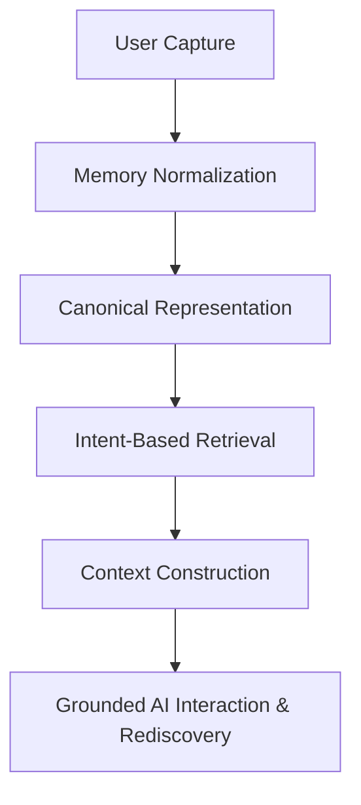

# Stashly Product Requirements Document (PRD)

**Status**: ACTIVE  
**Version**: 6.0  
**Authority**: Product Vision and Scope Definition  
**Last Updated**: 2026-06-25

---

## Table of Contents
1. [Vision](#vision)
2. [Product Mission](#product-mission)
3. [Product Principles](#product-principles)
4. [Product Scope](#product-scope)
5. [Core Product Capabilities](#core-product-capabilities)
6. [Product Workflow](#product-workflow)
7. [User Personas](#user-personas)
8. [Primary User Jobs](#primary-user-jobs)
9. [Functional Requirements](#functional-requirements)
10. [Non-Functional Requirements](#non-functional-requirements)
11. [Current Product State](#current-product-state)
12. [Product Roadmap](#product-roadmap)
13. [Success Metrics](#success-metrics)
14. [Product Boundaries](#product-boundaries)
15. [Guiding Product Principles](#guiding-product-principles)

---

## Vision

Stashly’s vision is to build a Universal AI Memory OS that reduces the human cognitive burden of remembering. A user's digital life should remember itself. Stashly exists to bridge information capture with trustworthy recovery so people can focus on learning, creating, and deciding rather than manually organizing.

---

## Product Mission

Modern digital life is fragmented across many platforms. Users save articles, repositories, videos, documents, and ideas in disconnected places, then later struggle to remember where something was saved or what it was called.

Stashly solves this fragmentation by turning saved information into one memory system and making it recoverable by intent. Users should be able to save once, forget safely, and retrieve later without administrative effort.

The representation contract for saved knowledge is defined in [Memory-Architecture-V1.md](/Users/sahilkishor/stashly/docs/product/Memory-Architecture-V1.md). The retrieval behavior that turns saved knowledge back into answers is defined in [Search-Architecture.md](/Users/sahilkishor/stashly/docs/product/Search-Architecture.md).

---

## Product Principles

Derived from [Philosophy.md](/Users/sahilkishor/stashly/docs/product/Philosophy.md), the following principles govern Stashly's product behavior:

* **Retrieval is the Primary Value**: Product success is measured by whether users can recover what matters.
* **Zero Organizational Burden**: Users should not need to maintain folders, tags, or manual classification just to recover saved value later.
* **Canonical Memory, Disposable Retrieval Artifacts**: The user's saved memory remains authoritative even as retrieval methods improve.
* **Grounded Trust**: AI-assisted features must remain bounded by retrieved user memory.

---

## Product Scope

Stashly maintains a strict boundary defining its role in the user's stack:

### What Stashly IS
* A personal AI-powered memory layer.
* A system for capturing and normalizing saved information.
* An intent-based retrieval experience over the user's own corpus.
* A grounded reasoning companion for saved knowledge.

### What Stashly IS NOT
* **Not a Bookmark Manager**: Manual organization is not the primary interaction model.
* **Not a Note-Taking Application**: Stashly may preserve notes, but it does not exist to replace rich authoring tools.
* **Not Cloud Storage**: It is a memory system, not a general-purpose file store.
* **Not a Generic Search Engine**: It searches the user's approved memory corpus, not the public web.

---

## Core Product Capabilities

Stashly's product capability model comprises the following core pillars:

### 1. Universal Capture
* *Purpose*: Let users save information with minimal interruption.
* *User Value*: Capture should feel immediate and low-friction.
* *Current Status*: Operational for URL-first capture.

### 2. Normalization & Memory Composition
* *Purpose*: Turn heterogeneous inputs into one consistent memory system.
* *User Value*: Saved information feels unified regardless of where it came from.
* *Current Status*: Operational for supported source types. Architectural details live in the Memory Architecture.

### 3. Hybrid Search & Retrieval
* *Purpose*: Recover the right memories from vague, partial, or exact user intent.
* *User Value*: Users can find what they saved without remembering titles, folders, or platforms.
* *Current Status*: Operational. Retrieval details live in the Search Architecture.

### 4. Grounded AI Chat
* *Purpose*: Let users ask questions against their saved knowledge.
* *User Value*: Users can get synthesized, memory-grounded help instead of manually piecing together many saved items.
* *Current Status*: Operational with grounded-memory constraints.

### 5. Corpus Diagnostics & Auditing
* *Purpose*: Preserve retrieval quality and memory recoverability over time.
* *User Value*: Saved knowledge remains dependable even when derived retrieval artifacts need repair or regeneration.
* *Current Status*: Operational as an internal maintenance capability.

---

## Product Workflow

The product workflow is designed around the lifecycle of a user's memory:

---

## User Personas

Stashly is built for individuals managing dense streams of professional and personal information:

* **Knowledge Workers**: Need to recover references without interrupting deep work.
* **Developers**: Need to surface saved repositories, documentation, issues, or patterns later.
* **Researchers & Students**: Need to recover sources, evidence, and quotes across many saved materials.
* **Founders & Creators**: Need a durable memory layer for inspiration, plans, and long-running ideas.

---

## Primary User Jobs

Users hire Stashly to satisfy these needs:
1. *"I want to save this now and return to what I was doing."*
2. *"I remember the idea, but not the title, source, or platform."*
3. *"I need to recover the exact source that mentioned something specific."*
4. *"I want to ask my saved knowledge a question and get a grounded answer."*
5. *"I want confidence that my saved knowledge remains recoverable over time."*

---

## Functional Requirements

### Current (Implemented)
* **Authenticated Saves**: Users can securely save supported inputs.
* **Fast Capture Confirmation**: Saving should confirm immediately while deeper processing happens later.
* **Memory Normalization**: Supported inputs are converted into a consistent memory form.
* **Intent-Based Retrieval**: Users can search using partial recall, exact terms, or conceptual intent.
* **Interactive Grounded Chat**: Users can ask questions and receive responses bounded by retrieved memory.
* **Citation Support**: AI-assisted responses must point back to retrieved source memories.
* **Recovery Operations**: Internal tooling can restore missing retrieval artifacts.

### Planned (Roadmap)
* **Multimodal Capture**: Capture beyond URL-first inputs.
* **Browser & Mobile Extensions**: Reduce capture friction across more user surfaces.
* **Contextual Auto-Collections**: Surface relationships without requiring manual organization.
* **Offline Local Mode**: Preserve access and assistance in more constrained environments.
* **Collaborative Contexts**: Share selected memory contexts with others.

---

## Non-Functional Requirements

* **Low Capture Friction**: Capture confirmation must feel immediate; deeper processing must remain asynchronous.
* **Grounded Reasoning Safety**: The Reasoning Engine must not answer from unsupported memory context.
* **User Isolation & Security**: Retrieval and reasoning must remain strictly scoped to the authenticated user.
* **Durable Recoverability**: Derived retrieval artifacts must be rebuildable from Canonical Representation.
* **Responsive Retrieval**: Search should feel fast enough to support natural recall.

---

## Current Product State

An honest assessment of the current product state:

### Implemented
* URL-first capture.
* Canonical memory normalization for supported sources.
* Intent-based retrieval across saved memory.
* Grounded AI chat over retrieved memory.
* Internal audit and recovery workflows to maintain retrieval integrity.

### Partially Implemented
* Retrieval quality controls are still evolving toward a more mature retrieval stack.
* Some user-facing capture surfaces remain narrower than the long-term product vision.

### Planned (Roadmap)
* Broader capture formats.
* Stronger relationship discovery across memories.

---

## Product Roadmap

Future product direction remains organized around a few clear themes:

* **Capture Expansion**: Make saving easier across more surfaces and formats.
* **Retrieval Quality**: Improve recovery accuracy, confidence, and scale.
* **Intelligence & Discovery**: Help users rediscover related knowledge without manual organization.
* **Grounded Synthesis**: Improve the quality of memory-grounded answers and explanations.

---

## Success Metrics

* **Retrieval Success Rate**: Percentage of queries where the user successfully recovers the intended memory or answer.
* **Enrichment Completion Rate**: Percentage of saves that successfully become usable memory.
* **Grounding Citation Accuracy**: Percentage of AI-assisted outputs that remain correctly tied to retrieved memory.
* **Time-to-Save**: Time between user capture and visible save confirmation.
* **Recovery Readiness**: Ability to restore retrieval capability from canonical memory after index loss.

---

## Product Boundaries

### In-Scope
* Turning raw saved inputs into durable memory.
* Retrieving saved knowledge by intent.
* Grounding AI-assisted answers in retrieved memory.
* Preserving recoverability and user trust.

### Out-of-Scope
* Manual folder hierarchies as the primary model.
* Editing source platforms or replacing source-authoring tools.
* Public web search.
* Ungrounded generative writing disconnected from saved memory.

---

## Guiding Product Principles

* **Save Once, Recover Later**: The core product contract is durable later recovery.
* **Intent Over Organization**: The system should reduce the urge to manually organize.
* **Context Over Hype**: AI is valuable only when it improves grounded recovery and understanding.
