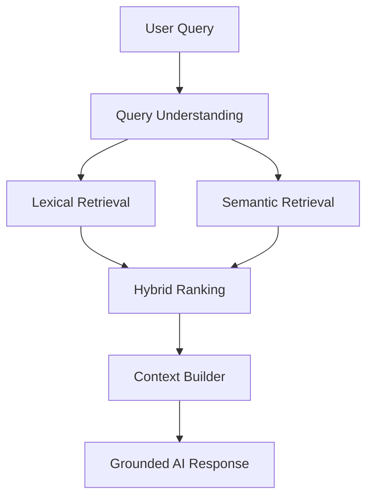
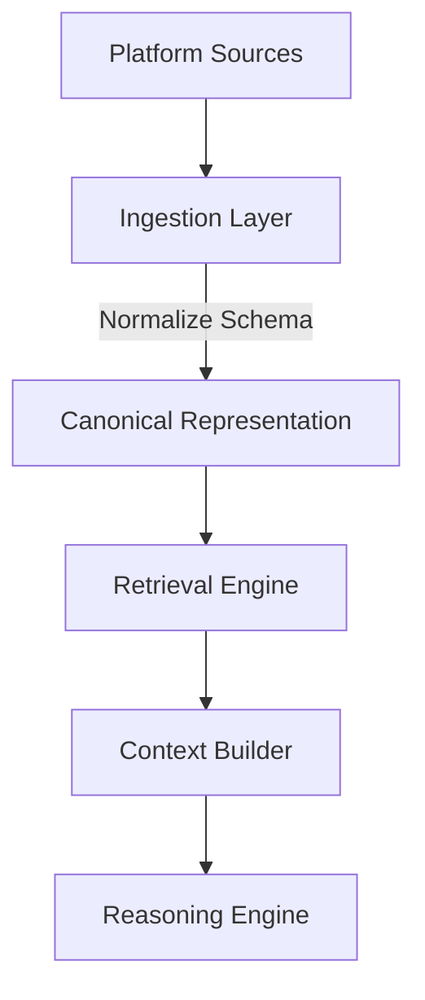

# Stashly Search & Retrieval Architecture

**Status**: ACTIVE  
**Version**: 2.0  
**Authority**: Retrieval and Grounded Intelligence Layer  
**Last Updated**: 2026-06-25

---

## Table of Contents
1. [Why Search Exists](#why-search-exists)
2. [Retrieval Philosophy](#retrieval-philosophy)
3. [Retrieval Quality Principles](#retrieval-quality-principles)
4. [Retrieval Contract](#retrieval-contract)
5. [Search Lifecycle](#search-lifecycle)
6. [Query Understanding](#query-understanding)
7. [Candidate Generation](#candidate-generation)
8. [Ranking](#ranking)
9. [Context Construction](#context-construction)
10. [Search Consumers](#search-consumers)
11. [Current Retrieval Architecture](#current-retrieval-architecture)
12. [Target Retrieval Architecture](#target-retrieval-architecture)
13. [Canonical vs Derived Search Data](#canonical-vs-derived-search-data)
14. [Search Boundary](#search-boundary)
15. [Architectural Invariants](#architectural-invariants)
16. [Evolution Roadmap](#evolution-roadmap)
17. [Architectural Evolution](#architectural-evolution)

---

## Why Search Exists

Inside Stashly, Search is not simply keyword lookup. Search is the retrieval layer that reconnects users with saved knowledge when recall is incomplete.

Users should not need to remember where, when, or on what platform something was saved. They only need to remember intent. The Retrieval Engine translates that intent into relevant, grounded memories and passes them to the Context Builder for downstream reasoning.

The representation contract for those memories is defined in [Memory-Architecture-V1.md](/Users/sahilkishor/stashly/docs/product/Memory-Architecture-V1.md). This document defines only how those memories are retrieved.

---

## Retrieval Philosophy

The retrieval architecture is governed by these principles:

* **Retrieval over Storage**: Storing memory is necessary, but recovering the right memory is the product value.
* **Recall before Ranking**: Retrieval should gather a broad candidate set before narrowing it.
* **Platform Independence**: Retrieval operates on Canonical Representation, never on source-specific payloads.
* **Hybrid Retrieval**: Retrieval combines semantic and lexical paths because intent can be expressed conceptually or exactly.
* **Grounded Context**: Retrieved results must support trustworthy downstream reasoning.
* **Recoverability**: Retrieval artifacts are Derived Data and remain disposable.

---

## Retrieval Quality Principles

The retrieval system optimizes four progressive outcomes:

```text
Recall  ->  Precision  ->  Grounded Context  ->  Reasoning Quality
```

1. **Recall**: Gather as many relevant memories as possible.
2. **Precision**: Remove weak or distracting candidates.
3. **Grounded Context**: Turn strong candidates into clear context blocks.
4. **Reasoning Quality**: Provide downstream reasoning with context that is accurate, bounded, and useful.

These goals justify hybrid retrieval. Semantic retrieval supports intent recovery. Lexical retrieval protects exact matches such as names, titles, and distinctive phrases.

---

## Retrieval Contract

Every retrieval implementation must satisfy these guarantees:

* **Source Isolation**: Retrieval consumes only Canonical Representation and Derived Data produced from it.
* **Read-Only Execution**: Retrieval must not mutate canonical memory during query execution.
* **Data Decoupling**: Ingestion and retrieval remain separate responsibilities.
* **Deterministic Candidate Sets**: Given the same query and same retrieval artifacts, candidate generation should be stable before ranking adjustments.
* **Provider Agnosticism**: The retrieval contract remains valid even if storage, embedding, or execution providers change.
* **Grounded Boundaries**: The Context Builder may use only retrieved memory context, never unstated background knowledge, as evidence.

---

## Search Lifecycle

The journey of a query from arrival to grounded response flows through the following stages:



---

## Query Understanding

Before retrieval begins, the system interprets the incoming query so both retrieval paths can operate effectively:

* **Normalization**: Clean the query into a stable retrieval input.
* **Lexical Preparation**: Preserve useful exact terms while reducing low-signal noise.
* **Semantic Preparation**: Transform the query into a form suitable for semantic matching.

> [!NOTE]
> **Current Implementation Note**
> The current implementation performs string normalization, stop-word filtering, and query embedding before retrieval.

---

## Candidate Generation

The Retrieval Engine gathers candidates from two independent paths:

### 1. Semantic Retrieval
Finds memories that are conceptually related to the user's intent.
* **Action**: Compare the query's semantic meaning against retrieval-oriented memory artifacts.

### 2. Lexical Retrieval
Finds memories that contain exact or near-exact textual signals.
* **Action**: Match query terms against retrieval-relevant text derived from memory.

Planned future candidate sources may exist, but they must still operate on canonical memory or Derived Data produced from it.

> [!NOTE]
> **Current Implementation Note**
> The current semantic path uses vector similarity over embedding records. The current lexical path scores textual memory fields in application runtime.

---

## Ranking

Candidate results are merged, scored, filtered, and ordered using the following architectural rules:

* **Score Fusion**: Semantic and lexical evidence are combined into one ranked result set.
* **Threshold Filtering**: Candidates that do not meet minimum relevance requirements are removed.
* **Duplicate Collapsing**: Equivalent memories are collapsed so the user sees one clear result rather than many copies.
* **Tie Breaking**: Stable tie-breaking ensures deterministic ordering for equivalent scores.
* **Highlighting**: Results should expose a concise explanation of what matched.

This document defines the ranking responsibilities, not the exact formulas used by a particular implementation.

> [!NOTE]
> **Current Implementation Note**
> The current implementation uses additive fusion, semantic thresholds, duplicate collapsing, recency tie-breaking, and highlight snippet generation.

---

## Context Construction

For grounded conversational retrieval, ranked memories are transformed into bounded context blocks by the **Context Builder**:

* **Selection**: Choose a limited set of the strongest retrieved memories.
* **Compression**: Present only the memory content needed for downstream reasoning.
* **Traceability**: Preserve enough structure that responses can be tied back to retrieved memories.
* **Zero-Retrieval Safety**: If retrieval is insufficient, the system must prefer a grounded fallback over unsupported reasoning.

> [!NOTE]
> **Current Implementation Note**
> The current Context Builder limits context to a small top-ranked set and strips internal identifiers before sending memory context to the reasoning layer.

---

## Search Consumers

Search and retrieval are consumed by several system surfaces:

* **Search API**: Returns ranked retrieval results to user-facing search experiences.
* **Chat API**: Uses retrieval output to build grounded context for the Reasoning Engine.
* **Search Analytics**: Observes retrieval behavior for system health and quality monitoring.

Future consumers may be added, but they must consume retrieval through the Retrieval Engine rather than bypassing it.

> [!NOTE]
> **Current Implementation Note**
> The current implementation exposes search through `GET /api/search`, chat through `POST /api/chat`, and records search analytics in administrative tooling.

---

## Current Retrieval Architecture

Stashly's retrieval system currently decomposes query processing into modular responsibilities:

```text
User Query
  -> Retrieval Engine
       -> Lexical Retrieval Path
       -> Semantic Retrieval Path
       -> Rank Fusion
       -> Context Builder
```

> [!NOTE]
> **Current Implementation Note**
> The current implementation performs semantic retrieval against stored vectors, lexical scoring in the application layer, and applies additional guardrails in the chat path to enforce grounding behavior.

---

## Target Retrieval Architecture

As Stashly scales, retrieval should become more efficient without changing its architectural contract:

* **Indexed Lexical Retrieval**: Lexical retrieval should move closer to indexed storage.
* **Scalable Semantic Retrieval**: Semantic retrieval should support larger corpora without changing the retrieval boundary.
* **Pluggable Embedding Providers**: Embedding generation should remain replaceable behind the Embedding Provider interface.

---

## Canonical vs Derived Search Data

Search maintains a strict boundary between authoritative memory and retrieval artifacts:

* **Canonical Data**: User saves and `MemoryV1` representations.
* **Derived Search Data**: Embeddings, lexical indexes, caches, and temporary ranking structures.

### Recovery Philosophy
All Derived Search Data is disposable. If retrieval artifacts are lost, the system can regenerate them from canonical memory without redefining the user's saved truth.

For the memory-side definition of Canonical Representation and Derived Data, see [Memory-Architecture-V1.md](/Users/sahilkishor/stashly/docs/product/Memory-Architecture-V1.md).

---

## Search Boundary

Search forms the boundary between memory representation and grounded reasoning.



Key boundary constraints include:
* **No Direct Schema Leaks**: Retrieval interacts only with canonical memory and Derived Data produced from it.
* **Decoupled Reasoning**: The Reasoning Engine consumes context from the Context Builder rather than reading memory or source-specific inputs directly.
* **Interface Stability**: New input sources should not require retrieval redesign if they satisfy the memory contract.

---

## Architectural Invariants

The following rules must always remain true:
* Search operations are read-only.
* Retrieval must never redefine canonical memory.
* Canonical Representation remains the source of truth for retrieval.
* Search results must always respect user scope boundaries.
* The Context Builder may only construct context from retrieved memory evidence.

---

## Evolution Roadmap

Retrieval should evolve by deepening capability within the existing boundary:

### Current Phase
* Hybrid retrieval over canonical memory artifacts.
* Context construction for grounded reasoning.
* Retrieval analytics and recovery support.

### Near Future
* Stronger indexed lexical retrieval.
* Better retrieval quality controls for grounded reasoning.
* More flexible Embedding Provider support.

### Long Term
* Additional retrieval sources derived from memory.
* Broader multimodal retrieval.
* More advanced ranking over larger memory corpora.

---

## Architectural Evolution

The following table compares the current implementation against the target direction:

| Capability | Current Implementation | Target Architectural Direction |
| :--- | :--- | :--- |
| **Query Understanding** | Text normalization and semantic query preparation. | Richer query interpretation across more input modes. |
| **Candidate Generation** | Semantic retrieval plus application-layer lexical retrieval. | More scalable retrieval over indexed semantic and lexical artifacts. |
| **Ranking** | Fixed score fusion and thresholding. | More adaptive ranking while preserving grounded boundaries. |
| **Retrieval Scope** | Independent memory retrieval. | Broader retrieval over richer derived memory artifacts. |
| **Context Construction** | Compact context blocks built from top-ranked results. | Stronger context synthesis while preserving traceability. |
| **Observability** | Basic retrieval analytics and audit support. | Deeper quality monitoring and retrieval diagnostics. |
| **Recovery** | Script-driven regeneration of missing artifacts. | More automated self-healing retrieval maintenance. |
