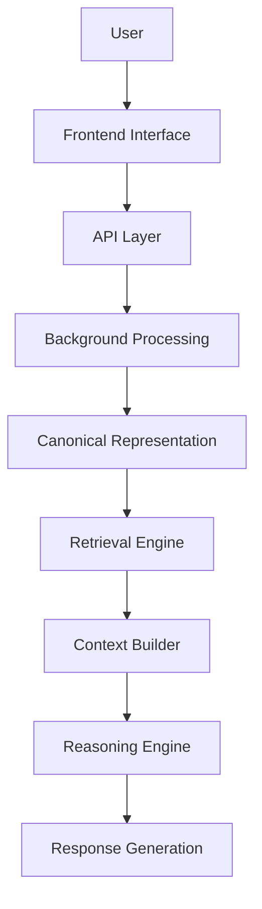
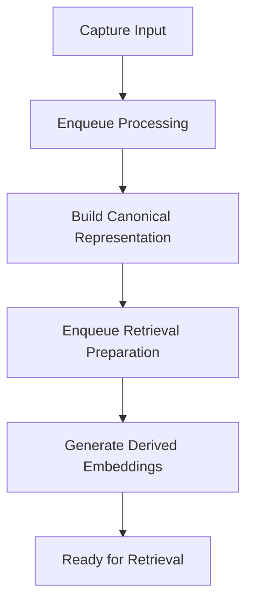
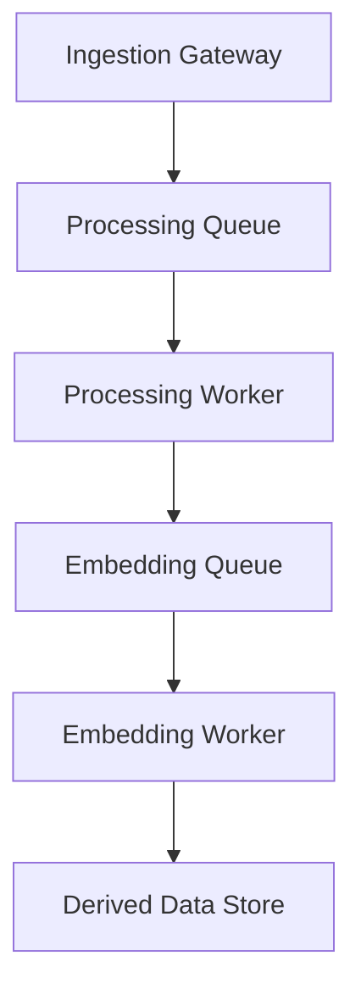

# Stashly Technical Requirements Document (TRD)

**Status**: ACTIVE  
**Version**: 5.0  
**Authority**: Technical Architecture and Engineering Contract  
**Last Updated**: 2026-06-25

---

## Table of Contents
1. [Purpose](#purpose)
2. [System Overview](#system-overview)
3. [System Components](#system-components)
4. [Frontend Architecture](#frontend-architecture)
5. [Backend Architecture](#backend-architecture)
6. [Processing Architecture](#processing-architecture)
7. [Storage Architecture](#storage-architecture)
8. [Retrieval Architecture](#retrieval-architecture)
9. [AI Architecture](#ai-architecture)
10. [Queue Architecture](#queue-architecture)
11. [Provider Abstraction](#provider-abstraction)
12. [Configuration Architecture](#configuration-architecture)
13. [Error Handling Philosophy](#error-handling-philosophy)
14. [Observability](#observability)
15. [Security Architecture](#security-architecture)
16. [Scalability Strategy](#scalability-strategy)
17. [Extension Points](#extension-points)
18. [Current Technical State](#current-technical-state)
19. [Current vs Target Architecture](#current-vs-target-architecture)
20. [Engineering Principles](#engineering-principles)

---

## Purpose

The Technical Requirements Document (TRD) is the primary engineering contract for Stashly. The PRD defines what users receive. This document defines how the system is engineered to deliver that product.

The TRD describes subsystem responsibilities, engineering boundaries, operational flows, and implementation alignment. It should complement, not replace, the Memory Architecture and Search Architecture. Representation details belong to [Memory-Architecture-V1.md](/Users/sahilkishor/stashly/docs/product/Memory-Architecture-V1.md). Retrieval behavior belongs to [Search-Architecture.md](/Users/sahilkishor/stashly/docs/product/Search-Architecture.md).

---

## System Overview

Stashly is engineered as an asynchronous memory system. Its high-level flow moves from capture to canonical memory, then from retrieval to grounded reasoning:

> [!NOTE]
> **Current Implementation Note**
> The current application uses a web frontend, a relational database, background job queues, and separate processing steps for memory construction and embedding generation.

---

## System Components

The Stashly architecture partitions responsibilities into core system components:

### 1. Authentication Gateway
* *Responsibility*: Validate user identity and establish secure user scope.
* *Inputs*: Login attempts and authentication callbacks.
* *Outputs*: Authenticated user context.
* *Dependencies*: Identity provider.
* *Status*: Implemented.

### 2. Ingestion Gateway
* *Responsibility*: Receive save requests, validate inputs, create initial records, and trigger background processing.
* *Inputs*: User capture requests.
* *Outputs*: Save records and processing work.
* *Dependencies*: Canonical store, background processing.
* *Status*: Implemented.

### 3. Processing Pipeline
* *Responsibility*: Enrich captures, construct Canonical Representation, and trigger retrieval preparation.
* *Inputs*: Processing jobs.
* *Outputs*: Completed memory records and follow-up retrieval preparation work.
* *Dependencies*: Platform Adapters, Canonical store, queueing system.
* *Status*: Implemented.

### 4. Platform Adapters
* *Responsibility*: Extract source-specific material and hand it to the normalization path.
* *Inputs*: Source content or references.
* *Outputs*: Structured inputs suitable for Canonical Representation.
* *Dependencies*: External content access.
* *Status*: Implemented.

### 5. Memory Representation
* *Responsibility*: Serialize and validate the Canonical Representation.
* *Inputs*: Normalized memory content.
* *Outputs*: `MemoryV1` records.
* *Dependencies*: Processing pipeline, persistence layer.
* *Status*: Implemented.

### 6. Embedding Pipeline
* *Responsibility*: Generate semantic retrieval artifacts from memory-derived text.
* *Inputs*: Completed memory records.
* *Outputs*: Derived embedding records.
* *Dependencies*: Embedding Provider, Derived Data store.
* *Status*: Implemented.

### 7. Retrieval Engine
* *Responsibility*: Coordinate lexical and semantic retrieval, ranking, and result assembly.
* *Inputs*: User query and authenticated scope.
* *Outputs*: Ranked memory candidates.
* *Dependencies*: Retrieval artifacts, Canonical Representation.
* *Status*: Implemented.

### 8. Reasoning Engine
* *Responsibility*: Answer user questions using context produced from retrieved memories.
* *Inputs*: User question and grounded context.
* *Outputs*: Grounded responses with citations.
* *Dependencies*: Retrieval Engine, Context Builder, reasoning provider.
* *Status*: Implemented.

### 9. Analytics & Auditing
* *Responsibility*: Observe retrieval behavior, processing outcomes, and system anomalies.
* *Inputs*: Query activity and operational events.
* *Outputs*: Monitoring and diagnostics signals.
* *Dependencies*: Logging and reporting surfaces.
* *Status*: Implemented.

### 10. System Diagnostics & Recovery Tooling
* *Responsibility*: Audit corpus integrity and restore missing Derived Data.
* *Inputs*: Administrative commands and system state.
* *Outputs*: Audit reports and recovery work.
* *Dependencies*: Canonical store, Derived Data store, queueing system.
* *Status*: Implemented.

> [!NOTE]
> **Current Implementation Note**
> Current administrative tooling includes save ingestion endpoints, background workers, and scripts such as `audit-corpus.ts`, `backfill-v2.ts`, and `requeue-missing-embeddings.ts`.

---

## Frontend Architecture

Stashly's frontend is a user interface for capture, retrieval, and grounded exploration:

* **Application Structure**: Feature-oriented surfaces for capture, search, chat, and administration.
* **Routing Philosophy**: Initial view delivery is separated from interactive retrieval and reasoning requests.
* **Client/Server Responsibilities**: The server establishes authenticated application boundaries. The client manages interactive state and streaming or live updates where needed.
* **State Management**: UI state should remain lightweight and scoped to active user tasks.
* **Rendering Strategy**: Rendering should optimize for fast capture, readable search, and grounded conversational clarity.

> [!NOTE]
> **Current Implementation Note**
> The current frontend uses server-rendered application routing, client-managed dashboard and chat state, and realtime save status updates.

---

## Backend Architecture

The backend is engineered as a stateless API and orchestration layer:

* **API Responsibilities**: Validate requests, enforce user scope, and route work to the correct subsystem.
* **Orchestration**: Decouple user-facing latency from slower memory construction and retrieval preparation work.
* **Business Logic & Boundaries**: Core system behavior should live in reusable subsystem modules rather than transport handlers.
* **Validation & Authorization**: Every request must be validated structurally and scoped to the authenticated user.

---

## Processing Architecture

Processing is structured as an asynchronous pipeline so capture remains fast and non-blocking:

1. **Ingestion**: Accept the save request and record it quickly.
2. **Representation Construction**: Normalize the source into `MemoryV1`.
3. **Retrieval Preparation**: Generate Derived Data needed by the Retrieval Engine.

> [!NOTE]
> **Current Implementation Note**
> The current implementation separates memory construction and embedding generation into distinct background stages.

---

## Storage Architecture

Stashly divides storage into two architectural zones:

* **Canonical Store**: Holds saves and `MemoryV1` Canonical Representation. The representation contract is defined in the Memory Architecture.
* **Derived Data Store**: Holds retrieval artifacts generated from canonical memory.
* **Recovery Philosophy**: Derived Data is disposable and must always be rebuildable from Canonical Representation.

> [!NOTE]
> **Current Implementation Note**
> The current persistence model separates save records, memory representations, and embedding records into different tables.

---

## Retrieval Architecture

Retrieval bridges saved memory with active user queries:

* **Lexical Retrieval Path**: Finds exact or near-exact textual matches.
* **Semantic Retrieval Path**: Finds conceptually related memory.
* **Rank Fusion**: Combines both paths into one ordered result set.
* **Boundary**: Retrieval consumes canonical memory and Derived Data but does not redefine them.

The detailed retrieval contract, ranking behavior, and Context Builder responsibilities are defined in [Search-Architecture.md](/Users/sahilkishor/stashly/docs/product/Search-Architecture.md).

---

## AI Architecture

Downstream AI capabilities translate retrieved memory context into grounded user-facing assistance:

* **Grounded Reasoning**: The Reasoning Engine answers questions only from retrieved memory context.
* **Context Builder**: Converts retrieval output into bounded context blocks suitable for reasoning.
* **Provider Abstraction**: Reasoning is routed through a provider boundary so models may change without redefining system architecture.
* **Safety**: When retrieval is insufficient, the system should prefer a bounded fallback over unsupported reasoning.

> [!NOTE]
> **Current Implementation Note**
> The current chat flow retrieves memory matches, strips internal identifiers, and sends a compact labeled context set to the reasoning provider.

---

## Queue Architecture

Background work is decoupled through dedicated queues so capture, memory construction, and retrieval preparation can scale independently:

* **Deduplication**: Queued work should collapse duplicate operations for the same memory when safe.
* **Worker Safeties**: Long-running tasks require lock and retry protections.
* **Queue Cleanup**: Successful and failed work should be retained only as long as operationally useful.

> [!NOTE]
> **Current Implementation Note**
> The current implementation uses distinct processing and embedding queues with queue-level deduplication and worker lock settings.

---

## Provider Abstraction

Stashly separates core logic from replaceable external systems through stable provider boundaries:

* **Authentication Gateway**: Maps user identity into system scope.
* **Embedding Provider**: Generates semantic retrieval artifacts from text.
* **Reasoning Provider**: Produces grounded language output from bounded memory context.
* **Content Extraction Gateway**: Resolves source-specific material for normalization.

> [!NOTE]
> **Current Implementation Note**
> The current implementation uses concrete providers for authentication, embeddings, reasoning, and content extraction behind these subsystem boundaries.

---

## Configuration Architecture

Configuration parameters are governed by clear environmental boundaries:

* **System Environment**: Service connections, secrets, and runtime endpoints.
* **Feature Flags & Versioning**: Pipeline version and controlled behavior switches.
* **System Constants**: Shared limits and thresholds that must remain consistent across processing and retrieval.

> [!NOTE]
> **Current Implementation Note**
> Current configuration includes pipeline versioning and shared processing constants such as chunk sizing.

---

## Error Handling Philosophy

Subsystem errors are classified into two execution patterns:

* **Recoverable Failures**: Transient issues should retry safely.
* **Permanent Failures**: Invalid or inaccessible inputs should fail explicitly without endless retry.
* **Self-Healing Derived Data**: Administrators should be able to audit and restore missing retrieval artifacts without redefining canonical memory.

---

## Observability

System operations are monitored through diagnostics and audit surfaces:

* **Corpus Audits**: Evaluate representation coverage, pipeline version alignment, and retrieval artifact health.
* **Retrieval Observability**: Record query behavior and retrieval outcomes for quality monitoring.
* **Recovery Workflows**: Support administrative backfills and repair operations.

> [!NOTE]
> **Current Implementation Note**
> The current implementation includes CLI audit and recovery scripts plus retrieval event logging.

---

## Security Architecture

The security model enforces data isolation at every layer:

* **Authentication**: Establish user identity before access.
* **Authorization**: Every read and write must be scoped to the authenticated user.
* **Tenant Isolation**: Retrieval and reasoning must never cross user boundaries.
* **Secret Management**: External credentials must remain outside source control and enter at runtime.

---

## Scalability Strategy

The platform scales through architectural decoupling:

* **Stateless Gateways**: User-facing request handlers can scale horizontally.
* **Decoupled Workers**: Processing and retrieval preparation can scale independently.
* **Storage-Assisted Retrieval**: Retrieval should move toward more scalable indexed storage rather than heavier application-layer scanning.

---

## Extension Points

Stashly supports expansion through stable subsystem boundaries:

* **Platform Adapters**: Add support for new input sources.
* **Embedding Providers**: Replace or expand semantic retrieval generation.
* **Reasoning Providers**: Change reasoning backends without redefining grounded behavior.
* **Lexical Retrieval Implementations**: Improve retrieval efficiency while preserving the retrieval contract.

---

## Current Technical State

An engineering assessment of the current implementation:

### Implemented
* Authentication and user-scoped save ingestion.
* Asynchronous memory construction and retrieval preparation.
* Platform adapters for currently supported input types.
* Canonical memory persistence plus derived retrieval artifacts.
* Hybrid retrieval and grounded chat behavior.
* Audit and recovery tooling for corpus maintenance.

### Partially Implemented
* Some retrieval responsibilities still rely on application-layer heuristics that should move toward stronger system-level retrieval behavior.
* Some engineering paths remain more optimized for current scope than long-term scale.

### Planned (Roadmap)
* Broader input handling.
* Stronger retrieval infrastructure.

---

## Current vs Target Architecture

The comparison table below outlines technical capability goals for Stashly:

| Technical Subsystem | Current Codebase Implementation | Target Architectural Direction |
| :--- | :--- | :--- |
| **Ingestion** | Asynchronous memory construction from supported inputs. | Broader, more scalable capture processing. |
| **Retrieval** | Hybrid retrieval with some application-layer logic. | More storage-assisted and scalable retrieval infrastructure. |
| **AI Integration** | Grounded reasoning with implementation guardrails. | Stronger provider flexibility and more mature grounding controls. |
| **Storage** | Separate canonical and derived persistence layers. | More scalable storage while preserving the same boundary. |
| **Queues** | Decoupled background workers. | More elastic asynchronous processing. |
| **Providers** | Concrete provider implementations behind abstraction boundaries. | Broader provider flexibility without architectural change. |
| **Observability** | Script-driven diagnostics and basic event monitoring. | Deeper quality and drift monitoring. |
| **Scalability** | Stateless request handling with background processing. | More automated scaling across subsystems. |

---

## Engineering Principles

Stashly development conforms to these engineering principles:
* **Canonical Representation is Sovereign**: The user's memory record must not be redefined by derived systems.
* **Derived Data is Ephemeral**: Retrieval artifacts must be rebuildable from canonical memory.
* **Platform Logic Terminates at Memory**: Source-specific logic ends before downstream retrieval and reasoning.
* **External Providers are Replaceable**: Providers are details behind stable subsystem boundaries.
* **Subsystems Own Single Responsibilities**: Each major component should do one architectural job well.
* **Architecture Prevents Drift**: Engineering must stay aligned with documented architecture.
* **Recoverability Over Fragility**: A repairable system is more valuable than an optimized but brittle one.
